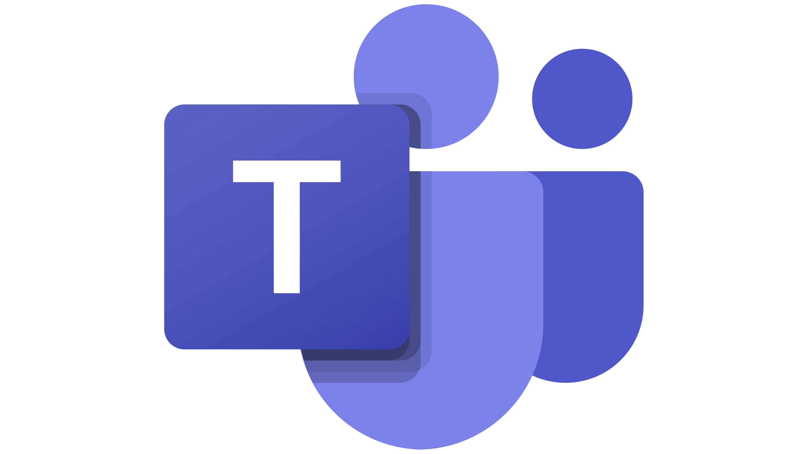

#  Teams SDK: Javascript


a suite of packages used to build on the Teams Platform.

> ⚠️ **Warning**: this project is not supported or affiliated with Microsoft in any way!

-   [Documentation](./docs/README.md)
-   [Why?](#why)
-   [Design Philosophy](#design-philosophy)
-   [Scripts](#scripts)
-   [Packages](#packages)
-   [Samples](#samples)
-   [Apps](#apps)

## Why?

Building agents and bots for Microsoft Teams can often involve a lot of boilerplate code and managing numerous dependencies, which can be time-consuming and complex. Our new SDK aims to simplify this process by minimizing the boilerplate and dependencies required, while also providing helpful AI/Teams native abstractions. This allows developers to focus more on creating intelligent and effective bots, rather than getting bogged down in setup and configuration. By streamlining the development process, we hope to make it easier and faster to build powerful, AI-driven bots for Microsoft Teams.

## Design Philosophy

These packages were designed with the following mentality to ensure longevity and sustainability.

### Low Dependency

[BotBuilder](https://github.com/microsoft/botbuilder-js) has struggled to support new LTS versions of node due to many dependencies being deprecated or requiring major version bumps (eg requires code changes to update).

By providing interfaces and default internal implementations, we mitigate this risk.

> ℹ️ **Note**: when necessary we will still use an external dependency, namely when an internal implementation is non-trivial.

### Unopinionated

[BotBuilder](https://github.com/microsoft/botbuilder-js) is a highly opinionated **Framework**, meaning it dictates many of the dos/don'ts of development with its packages.

This goal of this project is that they be a set of unopinionated packages that export simple abstractions for development in **Microsoft Teams**, leaving the app design descisions to the developer.

## Scripts

> all scripts can be run for a particular workspace by appending `--workspace=${name}`

### Build

```bash
$: npm run build
```

### Clean

```bash
$: npm run clean
```

### Format

```bash
$: npm run fmt
```

### Dev

> for apps/samples only

```bash
$: npm run dev
```

### Test

> for packages only

```bash
$: npm run test
```

## Packages

-   [`@teams.sdk/apps`](./packages/apps/README.md)
-   [`@teams.sdk/ai`](./packages/ai/README.md)
-   [`@teams.sdk/api`](./packages/api/README.md)
-   [`@teams.sdk/botbuilder`](./packages/botbuilder/README.md)
-   [`@teams.sdk/cards`](./packages/cards/README.md)
-   [`@teams.sdk/common`](./packages/common/README.md)
-   [`@teams.sdk/config`](./packages/config/README.md)
-   [`@teams.sdk/openai`](./packages/openai/README.md)

## Samples

-   [`@samples/echo`](./samples/echo/README.md)
-   [`@samples/botbuilder`](./samples/botbuilder/README.md)
-   [`@samples/auth`](./samples/auth/README.md)
-   [`@samples/lights`](./samples/lights/README.md)

## Apps

-   [`@apps/copilot`](./apps/copilot/README.md)

## Links

-   [Teams Developer Portal: Apps](https://dev.teams.microsoft.com/apps)
-   [Teams Toolkit](https://www.npmjs.com/package/@microsoft/teamsapp-cli)
